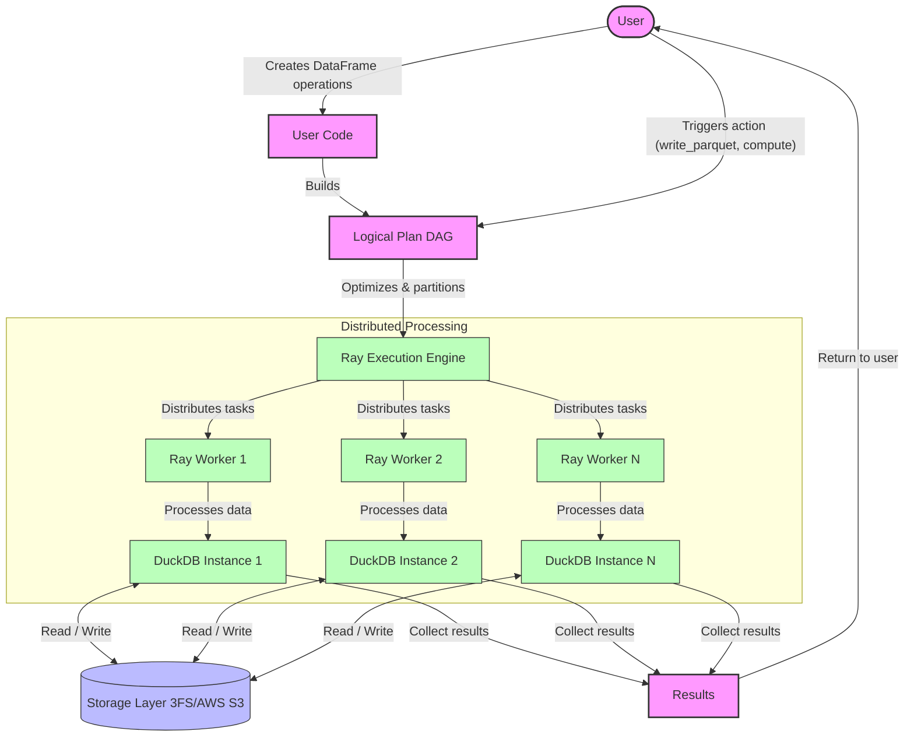

# smallpond

[](https://github.com/deepseek-ai/smallpond/actions/workflows/ci.yml)
[](https://pypi.org/project/smallpond/)
[](https://deepseek-ai.github.io/smallpond/)
[](LICENSE)

A lightweight **distributed** data processing framework built on [DuckDB] and [Ray], with [3FS] integration for high-performance storage.

## Features

- 🚀 High-performance data processing powered by DuckDB
- 🌍 Scalable to handle PB-scale datasets
- 🔄 Distributed execution through [Ray] for parallel processing of TBs data
- 🛠️ Easy operations with no long-running services
- 💾 Storage support for local filesystem and [3FS]
- 📈 Flexible partitioning strategies (hash, even, random)

## Architecture

smallpond uses a DAG-based execution model with lazy evaluation:
1. Operations build a logical plan as a directed acyclic graph (DAG)
2. Execution is triggered only when an action is called (write, compute, etc.)
3. Ray distributes tasks across workers, with each worker running its own DuckDB instance
4. Backend supported is 3FS, while local filesystem can also be used for smaller workloard or development



## Installation

Python 3.8 to 3.12 is supported.

```bash
pip install smallpond
```

## Quick Start

```bash
# Download example data
wget https://duckdb.org/data/prices.parquet
```

```python
import smallpond

# Initialize session (automatically starts a local Ray cluster)
sp = smallpond.init()

# Load data
df = sp.read_parquet("prices.parquet")

# Process data with partitioning for distributed execution
df = df.repartition(3, hash_by="ticker")
df = sp.partial_sql("SELECT ticker, min(price), max(price) FROM {0} GROUP BY ticker", df)

# Save results
df.write_parquet("output/")
# Show results
print(df.to_pandas())
```

## Documentation

For detailed guides and API reference:
- [Getting Started](docs/source/getstarted.rst)
- [API Reference](docs/source/api.rst)

## Performance

We evaluated smallpond using the [GraySort benchmark] ([script]) on a cluster comprising 50 compute nodes and 25 storage nodes running [3FS].  The benchmark sorted 110.5TiB of data in 30 minutes and 14 seconds, achieving an average throughput of 3.66TiB/min.

Details can be found in [3FS - Gray Sort].

[DuckDB]: https://duckdb.org/
[Ray]: https://ray.io/
[3FS]: https://github.com/deepseek-ai/3FS
[GraySort benchmark]: https://sortbenchmark.org/
[script]: benchmarks/gray_sort_benchmark.py
[3FS - Gray Sort]: https://github.com/deepseek-ai/3FS?tab=readme-ov-file#2-graysort

## Development

```bash
pip install .[dev]

# run unit tests
pytest -v tests/test*.py

# build documentation
pip install .[docs]
cd docs
make html
python -m http.server --directory build/html
```

## License

This project is licensed under the [MIT License](LICENSE).
